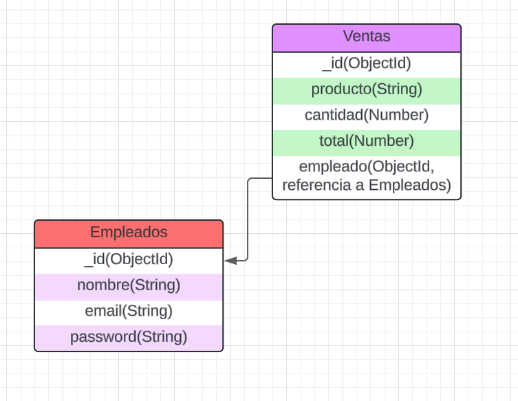

# Comercio de Suministros de Limpieza

## Descripción

Este proyecto implementa una aplicación para un comercio de suministros de limpieza, donde los empleados pueden registrar sus ventas de manera individual. Además, los empleados pueden autenticarse en la aplicación utilizando credenciales.

El proyecto está desarrollado utilizando **Node.js** con **Express** para el backend, **Mongoose** como ODM para **MongoDB**, y **bcryptjs** junto con **jsonwebtoken** para la autenticación de los empleados.

## Características

- **Registro e inicio de sesión de empleados**: Los empleados pueden registrarse utilizando un nombre, correo electrónico y contraseña, los cuales son almacenados de forma segura mediante el uso de `bcryptjs` para encriptar la contraseña.

- **Gestión de ventas**: Cada venta realizada por un empleado es registrada y asociada con el empleado que la realizó, utilizando relaciones referenciadas en MongoDB.

- **Relaciones entre empleados y ventas**: El modelo de ventas está referenciado al modelo de empleado, lo que facilita la asociación y consulta de ventas realizadas por cada empleado.

## Diagrama de Relaciones

En este proyecto, se decidió utilizar relaciones referenciadas entre las colecciones **Empleados** y **Ventas**. Las ventas son referenciadas a través del campo `empleado`, que guarda una referencia (`ObjectId`) al documento del empleado que realizó la venta. Esta elección se hizo para evitar que los documentos de empleados crezcan excesivamente en tamaño y para facilitar la escalabilidad cuando el número de ventas sea alto.

## Decisiones de Diseño

- **Relación referenciada**: Elegí referenciar las ventas dentro de los documentos de los empleados en lugar de embeber los documentos de ventas directamente en los empleados. Creo que esto es más eficiente cuando se esperan muchas ventas y permite que las colecciones sean más fáciles de manejar y consultar.

- **Autenticación con JWT**: Para autenticar a los empleados, utilicé tokens **JWT**, lo que permite manejar sesiones de usuario de forma más segura y escalable.

- **Encriptación de contraseñas**: Las contraseñas de los empleados se encriptan utilizando `bcryptjs` antes de almacenarse en la base de datos, asegurando la privacidad y seguridad de los datos.

